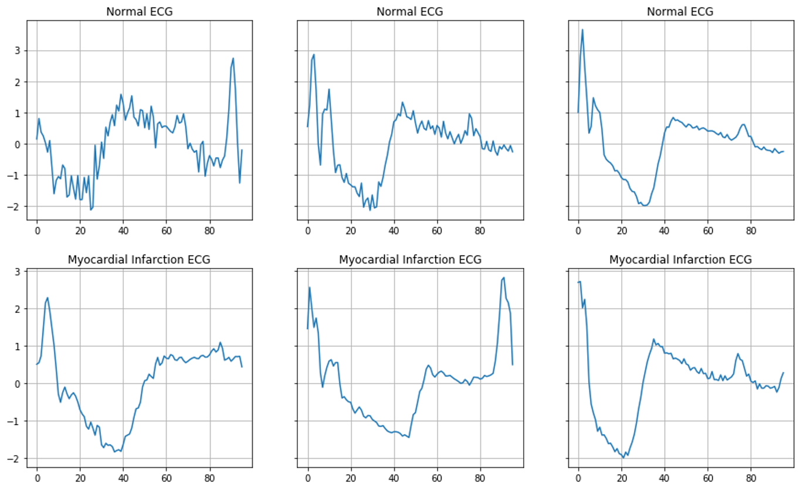

# ECG-Classification-with-Semi-supervised-Learning

Electrocardiogram (ECG) analysis is one of the tasks that deep learning may help physicians to diagnotic pateints faster and more accurate. For this repository, I will show how to apply Semi-Supervised Learning (SSL) to improve predictive model on a small dataset of ECG. I used [ECG200](http://www.timeseriesclassification.com/description.php?Dataset=ECG200) dataset formatted by R. Olszewski. The dataset only contains 100 samples for training and 100 samples for testing. Each series traces the electrical activity recorded during one heartbeat. The two classes are a normal heartbeat and a myocardial infarction. The examples of ECG for each class are shown in a figure below.

The challenge of this dataset is is quite small for a supervised deep learning model to work well. Therefore, **semi-supervised learning** is considered to learn features by Bi-directional LSTM Autoencoder (*Unsupervised learning*). After that, the encoder part (with pre-trained weights) of the autoencoder is used to build a RNN predictive model (*Supervised learning*). 

## SSL with Bi-LSTM model

### Evaluation on the Test Data
After training the model, the model was evaluated on the test data and it could achieve **91%** accuracy, which is *higher than the best accuracy score* showing in the [website](http://www.timeseriesclassification.com/description.php?Dataset=ECG200) (89.05%). The confusion matrix of SSL with Bi-LSTM model predictions on the testing is shown below.

#### References:
- http://www.timeseriesclassification.com/description.php?Dataset=ECG200
- https://www.tensorflow.org/tutorials/generative/autoencoder
